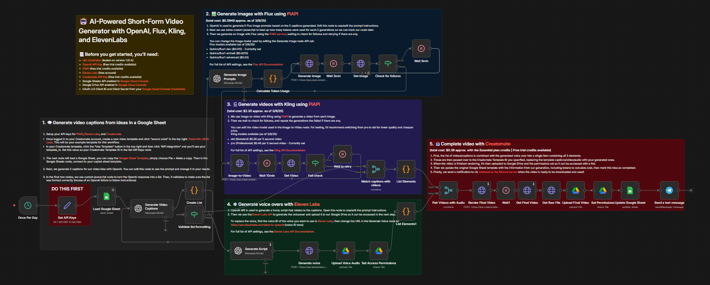
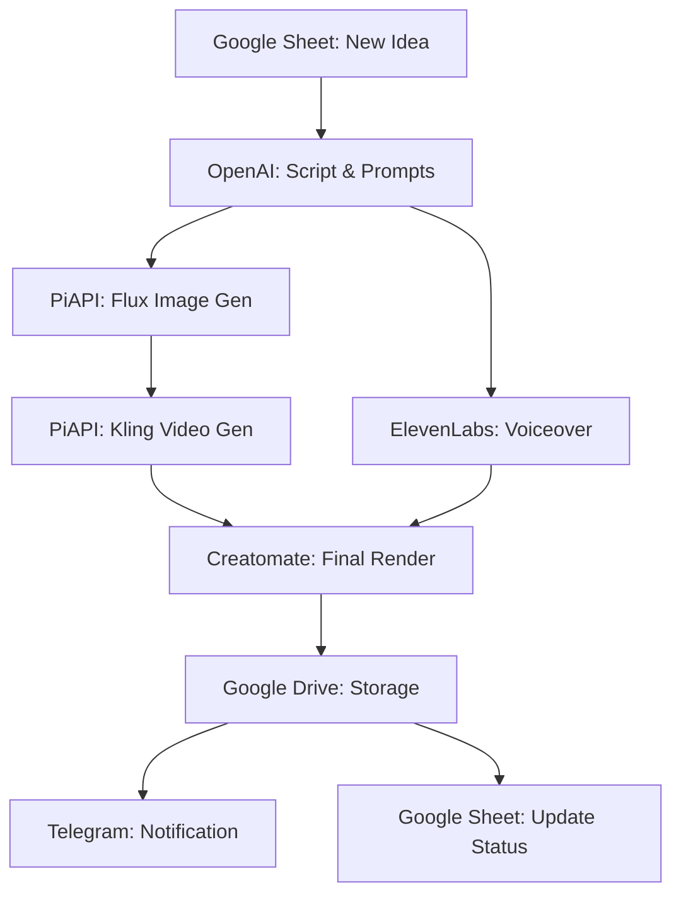

# AI-Powered Short-Form Video Generator 🤖🎬

An advanced, fully automated n8n workflow designed to transform educational ideas into high-quality, emotionally resonant short-form videos. Originally developed for **Special Education & Rehabilitation Centers** to raise awareness about Autism, Dyslexia, and Down Syndrome.

## 🌟 Key Features
- **🧠 Intelligent Content Engine:** Uses GPT-4o-mini to generate empathetic, professional scripts in Turkish/English.
- **🎨 Pixar-Style Visuals:** Automatically generates high-detail 3D animated prompts for Flux.1-dev.
- **🎬 Cinematic Video Motion:** Leverages Kling AI (via PiAPI) for professional-grade 5-second video clips.
- **🎙️ Human-Like Voiceovers:** Crystal clear TTS using ElevenLabs Multilingual v2.
- **🏗️ Automated Cloud Rendering:** Dynamically assembles video, audio, and subtitles via Creatomate.
- **📊 Production Tracking:** Full integration with Google Sheets for idea management and cost tracking.

---

## 🛠 Tech Stack & AI Models
| Task | Model / Service |
| :--- | :--- |
| **Orchestration** | [n8n](https://n8n.io/) |
| **Text Generation** | OpenAI `o3-mini` & `gpt-4o-mini` |
| **Image Generation** | [PiAPI](https://piapi.ai/) - `flux1-dev` |
| **Video Generation** | [PiAPI](https://piapi.ai/) - `kling v1.6` |
| **Voiceover (TTS)** | [ElevenLabs](https://elevenlabs.io/) - `multilingual_v2` |
| **Video Rendering** | [Creatomate](https://creatomate.com/) |

---

## 🚀 Setup Guide

### 1. Prerequisites
You will need API keys for the following services:
- **OpenAI:** For script and prompt generation.
- **PiAPI:** To access Flux (Images) and Kling (Video).
- **ElevenLabs:** For professional voiceovers.
- **Creatomate:** For final video assembly.
- **Google Cloud:** Sheets & Drive API enabled.

### 2. Google Sheets Setup
1. Copy this [Google Sheets Template](https://docs.google.com/spreadsheets/d/1cjd8p_yx-M-3gWLEd5TargtoB35cW-3y66AOTNMQrrM/edit?usp=sharing).
2. Set the `production` column to `for production` for the rows you want to process.

### 3. Creatomate Setup
1. Create a new template in Creatomate.
2. Go to "Source Code" (top right) and paste [this JSON configuration](https://pastebin.com/c7aMTeLK).
3. Copy your `Template ID` for the n8n configuration.

### 4. n8n Configuration
1. Import `src/workflow.json` into n8n.
2. Open the **"Set API Keys"** node and fill in your credentials.
3. Update the **"Load Google Sheet"** node with your specific Spreadsheet ID.
4. Update the **"Upload Voice Audio"** and **"Upload Final Video"** nodes with your Google Drive Folder IDs.

---

## 💸 Estimated Cost Analysis (per 20s Video)
| Component | Model | Approx. Cost |
| :--- | :--- | :--- |
| **Images (5 scenes)** | Flux.1-dev | ~$0.095 |
| **Videos (5 scenes)** | Kling Pro | ~$2.300 |
| **Rendering** | Creatomate | ~$0.380 |
| **Total** | | **~$2.775** |
*Note: Using Kling 'Std' instead of 'Pro' can significantly reduce costs.*

---

## 📐 Workflow Logic

---

## 🤝 Contributing
Contributions are welcome! Please see [CONTRIBUTING.md](CONTRIBUTING.md) for guidelines.

## 📄 License
This project is licensed under the MIT License - see the [LICENSE](LICENSE) file for details.

---
**Disclaimer:** *This tool is intended for educational and awareness purposes. Ensure you comply with the Terms of Service of all integrated AI providers.*
