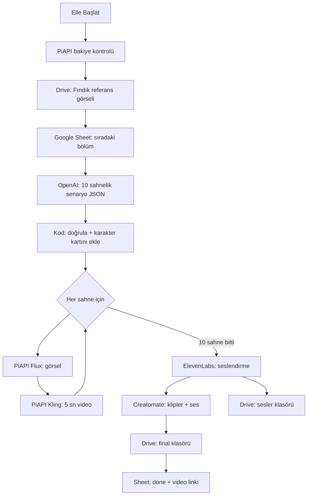

# Fındık'ın Meslek Macerası — Otomatik Çocuk Dizisi Üretici 🦊🎬

[](https://n8n.io/)
[](https://opensource.org/licenses/MIT)

Meraklı minik tilki **Fındık**'ın her bölümde başka bir mesleği tanıdığı ve güzel bir davranış öğrendiği 45–60 saniyelik çocuk dizisini üreten bir n8n workflow'u.

**Şu anki mod: yarı otonom.** Bölümleri sen Google Sheet'e yazarsın, workflow'u elle başlatırsın; bitmiş video Google Drive'daki `final` klasörüne düşer. Başka hiçbir yere yüklenmez.

- Dizi kuralları, karakter kartı ve bölüm şablonu: [content/seri-rehberi.md](content/seri-rehberi.md)
- 1. sezonun 10 bölümü (Google Sheet'e aktarılacak): [content/sezon-1.csv](content/sezon-1.csv)
- n8n workflow'u: [src/workflow.json](src/workflow.json)
- Fındık'ın görselleri: [assets/findik-karakter-sayfasi.png](assets/findik-karakter-sayfasi.png), [assets/findik-referans.png](assets/findik-referans.png)

---

## 📐 Akış



**Karakter tutarlılığı:** Fındık her sahnede Drive'daki referans görsele göre çizilir (Flux Kontext). Görünüş tarifi (karakter kartı) de her görsel prompt'una yapay zekâ tarafından değil, **kodla birebir** eklenir.

**Para koruması:** Workflow başta PiAPI bakiyesini kontrol eder, referans görseli bulamazsa ya da bakiye yetmezse hiçbir şey üretmeden durur. Hata alan görsel/video en fazla 3 kez yeniden denenir.

---

## 🚀 Kurulum

### 1. Hesaplar ve API anahtarları
| Servis | Ne için |
| :--- | :--- |
| [OpenAI](https://platform.openai.com/) | Senaryo (`gpt-4o-mini`) |
| [PiAPI](https://piapi.ai/) | Flux (görsel) ve Kling (video) |
| [ElevenLabs](https://elevenlabs.io/) | Türkçe seslendirme (`eleven_multilingual_v2`). **En az Starter planı gerekir:** ücretsiz plan Voice Library seslerini API'de kullandırmaz ve ticari kullanım hakkı vermez |
| [Creatomate](https://creatomate.com/) | Videoyu birleştirme (şablon gerekmez) |
| Google Cloud | Sheets API ve Drive API açık olmalı |

### 2. Google Sheet
1. Drive'da `ai-powered-video/Seneryo` içinde bir Google Sheet aç, **Dosya → İçe aktar** ile `content/sezon-1.csv` dosyasını yükle (tablo adı `sezon-1`).
2. Üretilmesini istediğin bölümlerin `production` sütunu `for production` olmalı (CSV'de hepsi öyle). Workflow her çalıştığında sıradaki **ilk** bölümü alır ve bitince `done` yapar.
3. Tablonun adresinden iki değeri not al: `/d/` ile `/edit` arasındaki **Sheet ID** ve sondaki `#gid=` sonrasındaki **sekme ID**.

### 3. n8n
1. `src/workflow.json` dosyasını n8n'e içe aktar.
2. **Ayarlar** node'unu doldur:

| Alan | Açıklama |
| :--- | :--- |
| `PiAPI Key`, `ElevenLabs API Key`, `Creatomate API Key` | API anahtarları |
| `ElevenLabs Voice ID` | Anlatıcı sesi. Sıcak, masalcı bir Türkçe ses seç |
| `Google Sheet ID` | `ai-powered-video/Seneryo/sezon-1` tablosunun ID'si (URL'de `/d/` ile `/edit` arası) |
| `Google Sheet Sekme ID` | Sekmenin ID'si (URL'de `#gid=` sonrası; yeni tabloda genelde `0`) |
| `Drive Ses Klasor ID` | `ai-powered-video/sesler` klasörünün ID'si (URL'de `/folders/` sonrası) |
| `Drive Final Klasor ID` | `ai-powered-video/final` klasörünün ID'si |
| `Drive Referans Klasor ID` | `ai-powered-video/fındık referans` klasörünün ID'si (aşağıya bak) |
| `Kling Mode` / `Kling Version` | `std` / `1.6` (ucuz). Kalite için `pro` |
| `Minimum PiAPI Bakiye USD` | Bakiye bunun altındaysa workflow başlamadan durur (varsayılan `3.5`) |

3. Google credential'ı için Google Cloud'da bir OAuth istemcisi (Web application) oluştur; redirect URI: `http://localhost:5678/rest/oauth2-credential/callback`. Uygulama *Testing* modundaysa kendi Gmail adresini test kullanıcısı olarak ekle.
4. Credential bağla: **Senaryo Yaz** (OpenAI), Sheets node'ları (**Bölümleri Oku**, **Tabloyu Güncelle**) ve Drive node'ları (**Referans Görseli Bul**, **Referans Paylaşım İzni**, **Ses Dosyasını Yükle**, **Ses Paylaşım İzni**, **Videoyu Arşivle**).
5. **Elle Başlat** → *Execute workflow* ile bir bölüm üret. Video `final` klasörüne `Bölüm N - Meslek.mp4` adıyla düşer.
6. İleride tam otomatiğe geçmek istersen kapalı duran **Her Gün 07:00** node'unu aktif et.

> n8n editörü Sheets sütunlarını ifadeyle verilen belgeden yükleyemezse **Bölümleri Oku** ve **Tabloyu Güncelle** node'larında belgeyi *By ID* (sabit) ve sekmeyi *From list* ile seç. **Bölümleri Oku** filtresi `production = for production`, **Tabloyu Güncelle** sadece `id` (eşleşme), `production = done` ve `final_output` sütunlarını yazmalı; diğer sütunları silmezsen tablodaki bilgiler boşalabilir.
>
> Seslendirme dosyası "linke sahip olan görüntüleyebilir" olarak paylaşılır, çünkü Creatomate'in onu indirebilmesi gerekir. Final videolar özel kalır.

### 4. Fındık'ın referans görseli (zorunlu)
1. Drive'da `ai-powered-video` altında `fındık referans` klasörünü aç ve içine [assets/findik-referans.png](assets/findik-referans.png) dosyasını yükle. Klasörde **tek bir görsel** olsun (PNG/JPEG/WebP). Görsel tek bir Fındık içermeli ve **4 megapikseli geçmemeli** (PiAPI sınırı).
2. Klasörün ID'sini **Ayarlar → Drive Referans Klasor ID** alanına yaz.
3. Workflow her çalıştığında bu PNG'yi Drive'dan bulur, Creatomate/PiAPI erişebilsin diye "linke sahip olan görüntüleyebilir" yapar ve **her sahnede** Fındık'ı bu görsele göre çizer (Flux Kontext). Kling videoları da bu görsellerden üretildiği için Fındık videolarda da aynı kalır.
4. Fındık'ın görünüşünü değiştirmek istersen klasördeki PNG'yi değiştirmen yeterli. Klasörde görsel yoksa workflow en başta hata verip durur, para harcamaz.

---

## 💸 Tahmini maliyet (50 sn'lik bölüm başına)
| Kalem | Model | Yaklaşık |
| :--- | :--- | :--- |
| 10 görsel | Flux Kontext | ~$0.2–0.3 |
| 10 video klip | Kling 1.6 std | ~$2.60 |
| Seslendirme | ElevenLabs | abonelik kotasından |
| Kurgu | Creatomate | ~$0.40–0.80 |
| **Toplam** | | **~$3.2–3.6** |

Bir bölümün üretimi, sahneler sırayla işlendiği için yaklaşık 1–1,5 saat sürer.

---

## 🛠 Geliştirme
Workflow elle değil, betikle üretilir; değişiklikleri `scripts/build_workflow.py` üzerinde yapıp yeniden üret:

```bash
python scripts/build_workflow.py src/workflow.json
node scripts/test_workflow.js
```

`scripts/make_local.py`, yeni sürümü yerel n8n'deki mevcut ayarlarla (anahtarlar, klasör ID'leri, credential'lar, Sheets düzeltmeleri) birleştirip `local/workflow.local.json` olarak yazar. `local/` klasörü git'e girmez; **n8n'den dışa aktardığın workflow'u asla `src/` altına kaydetme**, içinde API anahtarların olur.

---

## 🤝 Katkı ve lisans
Bu proje, [Cullinan-coder/ai-powered-video-generator](https://github.com/Cullinan-coder/ai-powered-video-generator) workflow'u temel alınarak çocuk dizisine uyarlanmıştır. Katkı için [CONTRIBUTING.md](CONTRIBUTING.md), lisans için [LICENSE](LICENSE) (MIT).

**Not:** Entegre edilen tüm yapay zekâ servislerinin kullanım koşullarına uymak kullanıcının sorumluluğundadır.
